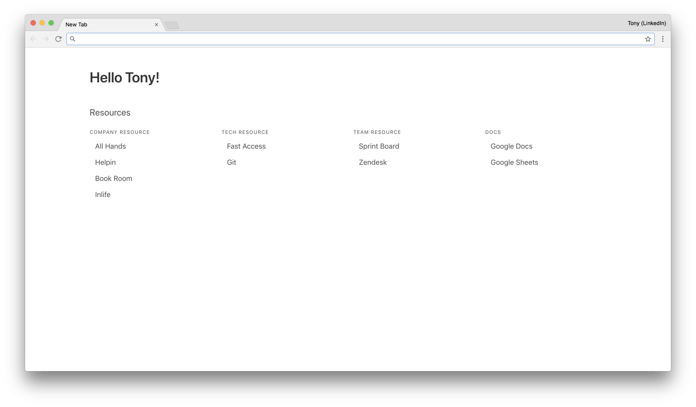

有没有想过改造Chrome的默认新标签页? 如果有，我相信你肯定尝试过去Chrome应用商店下载一些拓展来定制新标签页。如果你觉得无论是默认，还是第三方提供的新标签页都无法满足你的需求，我建议你跟着我尝试自己制作一款Chrome拓展来定制你的新标签页。

## 拓展插件目录结构

```sh
└── chrome-extention //你的Chrome拓展项目目录
    ├── manifest.json //Chrome拓展描述文件
    └── newTab.html //Chrome拓展新标签页页面文件
```

## 创建Chrome拓展描述文件

创建一个文件夹，作为Chrome拓展的项目文件夹。在文件夹内创建`manifest.json`描述文件如下:

```json
{
    "name": "Chrome extension name here.",
    "version": "1.0",
    "manifest_version": 2,
    "description": "Chrome extension description written here.",
    "chrome_url_overrides" : {
        "newtab": "newTab.html"
    },
    "content_security_policy": "script-src 'self'; object-src 'self'"
}
```

## 创建自定义新标签页面

在Chrome拓展项目文件夹内创建`newTab.html`文件，这个文件就是你即将替换为新标签页的网页文件。如果你对HTML/CSS并不熟悉，可以仿照我的写法，把新标签页制作成如下所示的网址导航。



`newTab.html`参考源码:

```html
<html>
    <head>
        <meta charset="utf-8">
        <meta name="viewport" content="width=device-width, initial-scale=1">
        <title>New Tab</title>
        <link rel="stylesheet" href="https://cdnjs.cloudflare.com/ajax/libs/bulma/0.7.1/css/bulma.min.css">
    </head>
    <body>
        <section class="section">
            <div class="container">
                <h1 class="title">
                    Hello Tony!
                </h1>
                <br>
                <p class="subtitle">
                    Resources
                </p>
                <div class="columns">
                    <div class="column">
                        <div class="menu">
                            <p class="heading">Company Resource</p>
                            <ul class="menu-list">
                                <li>
                                    <a href="">All Hands</a>
                                </li>
                                <li>
                                    <a href="">Helpin</a>
                                </li>
                                <li>
                                    <a href="">Book Room</a>
                                </li>
                                <li>
                                    <a href="">Inlife</a>
                                </li>
                            </ul>
                        </div>
                    </div>
                    <div class="column">
                        <div class="menu">
                            <p class="heading">Tech Resource</p>
                            <ul class="menu-list">
                                <li>
                                    <a href="">Fast Access</a>
                                </li>
                                <li>
                                    <a href="">Git</a>
                                </li>
                            </ul>
                        </div>
                    </div>
                    <div class="column">
                        <div class="menu">
                            <p class="heading">Team Resource</p>
                            <ul class="menu-list">
                                <li>
                                    <a href="">Sprint Board</a>
                                </li>
                                <li>
                                    <a href="">Zendesk</a>
                                </li>
                            </ul>
                        </div>
                    </div>
                    <div class="column">
                        <div class="menu">
                            <p class="heading">Docs</p>
                            <ul class="menu-list">
                                <li>
                                    <a href="https://docs.google.com/document">Google Docs</a>
                                </li>
                                <li>
                                    <a href="https://docs.google.com/spreadsheets">Google Sheets</a>
                                </li>
                            </ul>
                        </div>
                    </div>
                </div>
            </div>
        </section>
    </body>
</html>
```

我的源码可以直接使用，但是记得模仿我的写法把链接的文本和网址替换成你的常用网址。

## 在Chrome浏览器加载你的拓展

打开Chrome浏览器的拓展管理([chrome://extensions](chrome://extensions)), 开启开发者模式(Developer mode), 加载未打包拓展(LOAD UNPACKED)


恭喜你，现在打开新标签页就会显示你自定义的页面了。

## 拓展阅读

如果你对HTML/CSS比较熟悉，可以探索添加更多内容，比如:

- 实时天气(如果你所在的城市天气多变): [https://weatherwidget.io](https://weatherwidget.io)
- 全球时区(如果你需要和来自其他国家的人交流): [https://time.is/widgets](https://time.is/widgets)
- Google日历(如果你希望随时查看日程): [https://support.google.com/calendar/answer/41207?hl=en](https://support.google.com/calendar/answer/41207?hl=en)

## 参考资料

- [Getting Started Tutorial](https://developer.chrome.com/extensions/getstarted)
- [Override Pages](https://developer.chrome.com/extensions/override)