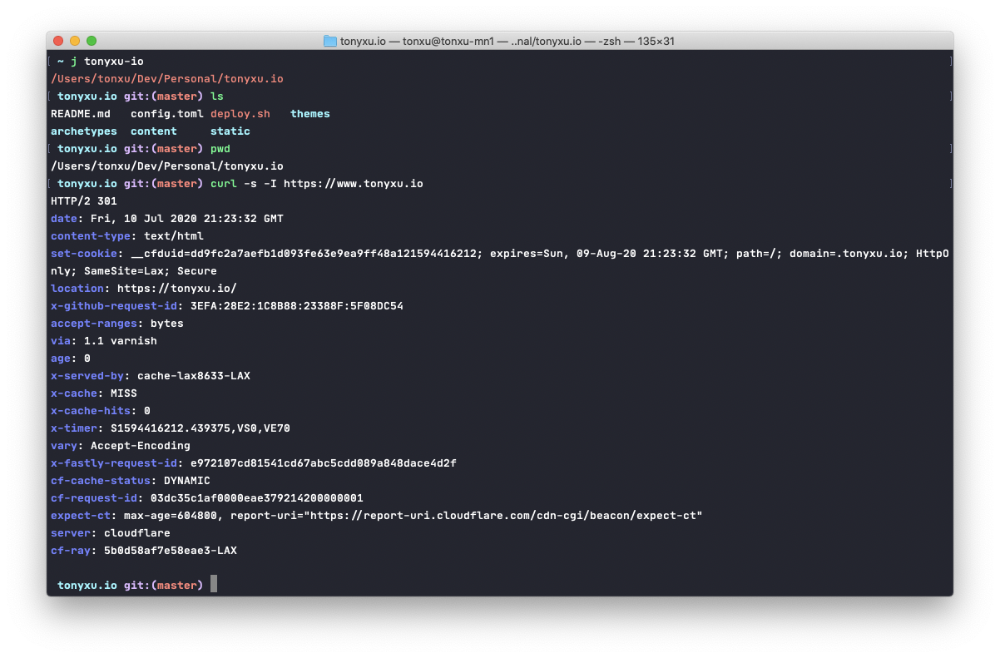

If you are using Mac as development machine, `Terminal.app` must be one of the most used apps. Terminal might be not fancy to begin with, but you can totally make it more elegant and fancy if you follow with me.



## We will be doing these for our Terminal

1. Install Terminal Profile: Customize Terminal Color
2. Install `oh-my-zsh`: Use powerful `zsh` for Terminal, instead of `shell`
3. Install `oh-my-zsh` themes: Beautify `oh-my-zsh`
4. Instal `oh-my-zsh` must-have plugins: Get more advanced and convenient features for Terminal

## Preparation

Recommend to install `homebrew` first:

```sh
/usr/bin/ruby -e "$(curl -fsSL https://raw.githubusercontent.com/Homebrew/install/master/install)"
```

Install zsh if you are on macOS version prior to Catalina:

```sh
# Install zsh
brew install zsh
# Set zsh as your default shell
chsh -s /usr/local/bin/zsh
```

## Install Terminal Profile

1. Go to [osx-terminal-theme](https://github.com/lysyi3m/osx-terminal-themes) and download your favorite theme in `scheme` folder
2. Double click the theme file to install and set as default

Feel free to use my Terminal Profile if you would like to try: https://gist.github.com/tonyxu-io/6b845cb1a53622eb4f1ce4063365e427

## Install oh-my-zsh

> Oh My Zsh is a delightful, open source, community-driven framework for managing your Zsh configuration. It comes bundled with thousands of helpful functions, helpers, plugins, themes, and a few things that make you shout...

Install `oh-my-zsh`:

```sh
sh -c "$(curl -fsSL https://raw.github.com/robbyrussell/oh-my-zsh/master/tools/install.sh)"
```

## Install oh-my-zsh theme

### Built-in themes

`oh-my-zsh` provides some built-in themes which you can immediately use:

1. Find your favorite theme in built-in themes list: https://github.com/robbyrussell/oh-my-zsh/wiki/Themes
2. Set `ZSH_THEME` to your favorite theme name in `~/.zshrc`
3. Activate setting by `source ~/.zshrc`

### Third-party themes

There are more third-party themes developped for `oh-my-zsh`, find and install them here:

https://github.com/robbyrussell/oh-my-zsh/wiki/External-themes

## Install oh-my-zsh must-have plugins

`oh-my-zsh` has many powerful plugins, below are some must-have plugins that will boost your productivity.

Sample config:

```sh
# ~/.zshrc:
plugins=(
  git
  zsh-syntax-highlighting
)
```

### git

Built-in，use abbreviations for git commands, e.g. `gaa` -> `git add --all`, use `alias | grep git` to get all abbreviations commands

Activate: Add to `~/.zshrc` plugins section

### extract

Built-in, no need to use complicated `tar` to extract zip files

Activate: Add to `~/.zshrc` plugins section

### autojump

Use `j` to quickly jump to a folder, e.g. `j Downloads` -> `cd ~/Downloads`

Install: `brew install autojump`

Follow instructions and add below line in `~/.zshrc`:

```sh
[ -f /usr/local/etc/profile.d/autojump.sh ] && . /usr/local/etc/profile.d/autojump.sh
```

### zsh-syntax-highlighting

Commands syntax highlight plugin

Install: `brew install zsh-syntax-highlighting`

Add `zsh-syntax-highlighting` to `~/.zshtc` plugins section

Other install guides: [https://github.com/zsh-users/zsh-syntax-highlighting/blob/master/INSTALL.md](https://github.com/zsh-users/zsh-syntax-highlighting/blob/master/INSTALL.md)

### zsh-autosuggestions

Auto complete commands by typing →

Install: `brew install zsh-autosuggestions`

Follow instructions and add below line in `~/.zshrc`:

```sh
source /usr/local/share/zsh-autosuggestions/zsh-autosuggestions.zsh
```

## My own ~/.zshrc config

```sh
# Path to your oh-my-zsh installation.
export ZSH=/Users/tonxu/.oh-my-zsh

# theme
ZSH_THEME="robbyrussell"

# plugins
plugins=(
  git
  extract
  zsh-syntax-highlighting
)

source $ZSH/oh-my-zsh.sh

# set language
export LANG=en_US.UTF-8

# default editor
export EDITOR='vi'

# ssh key path
export SSH_KEY_PATH="~/.ssh/rsa_id"

# load autojump plugin
[ -f /usr/local/etc/profile.d/autojump.sh ] && . /usr/local/etc/profile.d/autojump.sh

# The next line updates PATH for the Google Cloud SDK.
if [ -f '/Users/tonxu/google-cloud-sdk/path.zsh.inc' ]; then source '/Users/tonxu/google-cloud-sdk/path.zsh.inc'; fi

# load auto-suggestions plugin
source /usr/local/share/zsh-autosuggestions/zsh-autosuggestions.zsh
```
