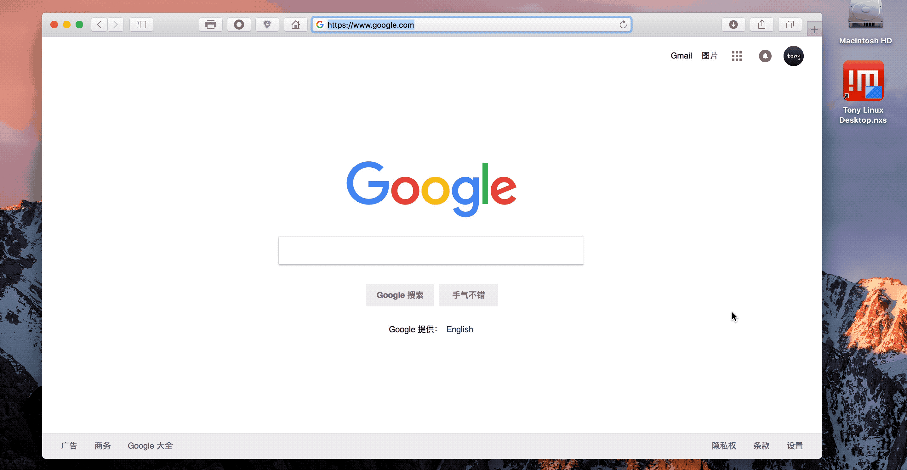
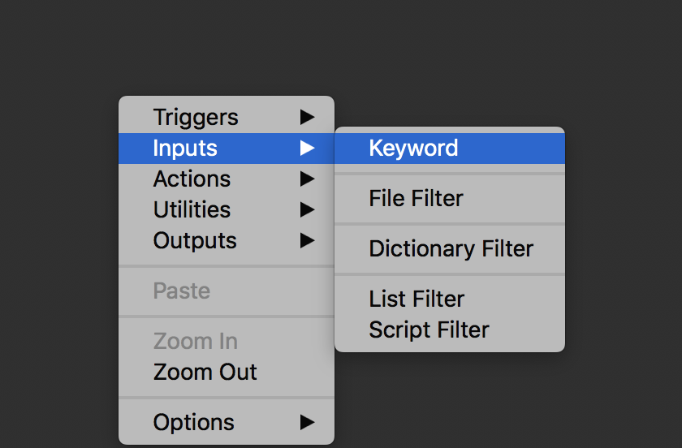
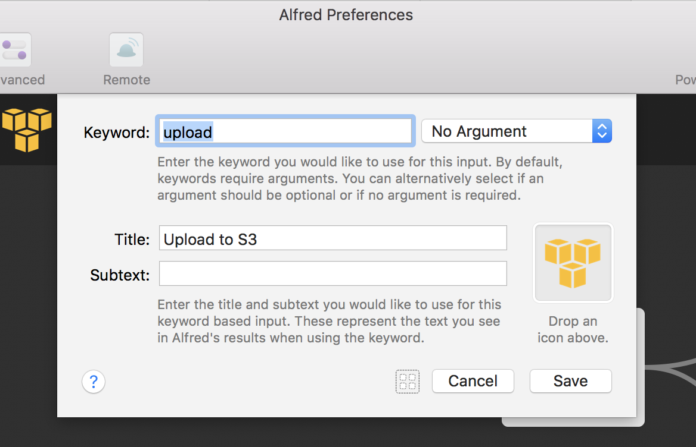
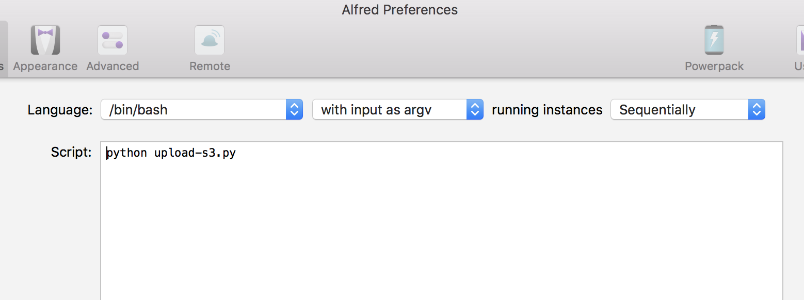
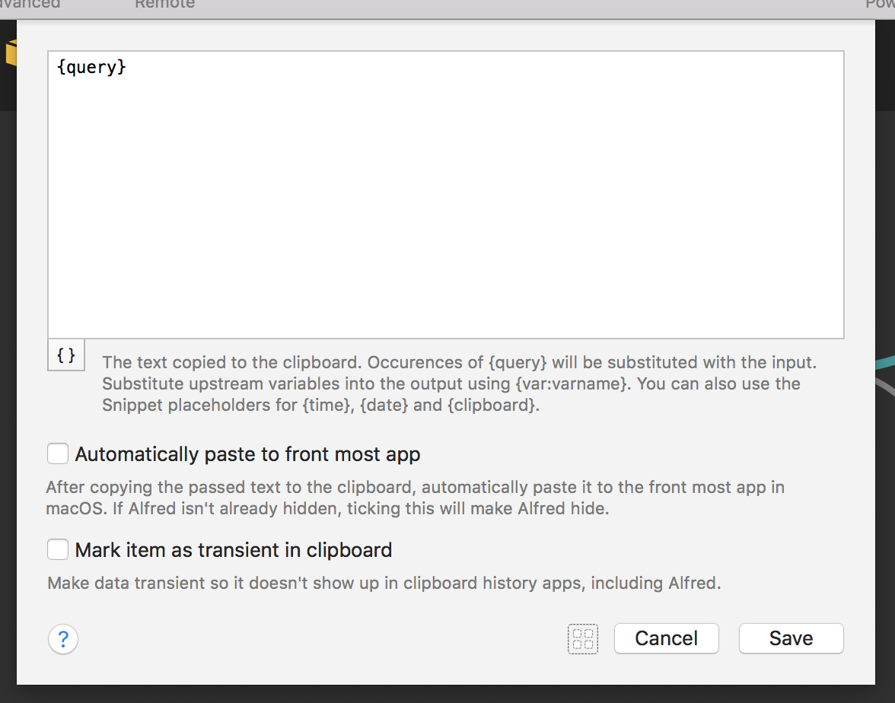
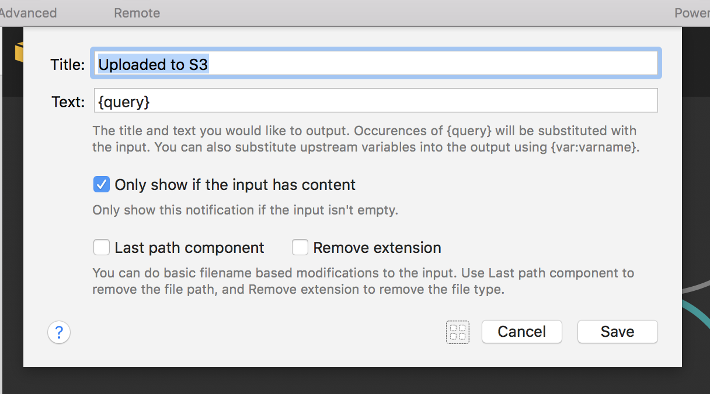
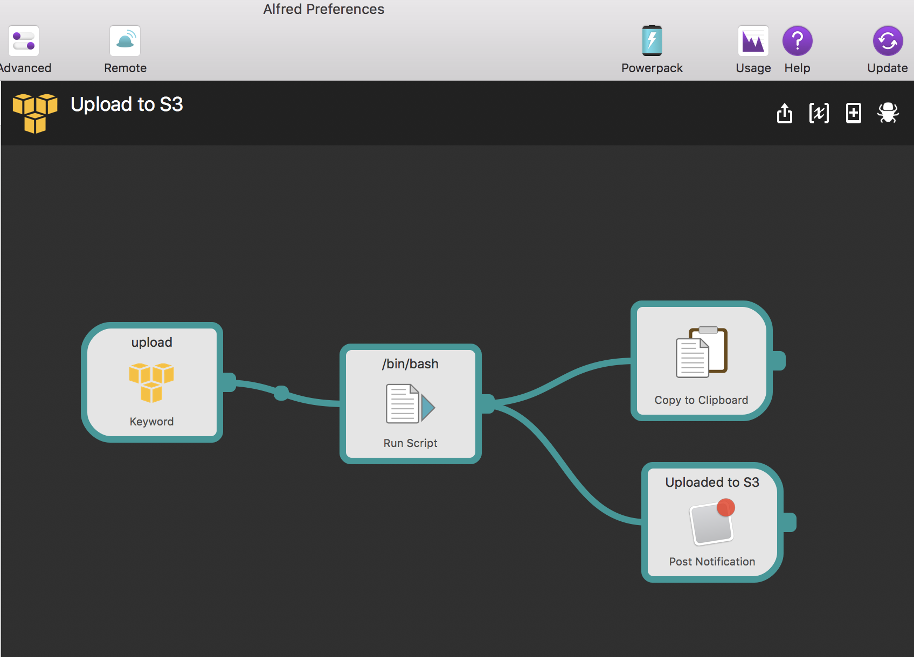
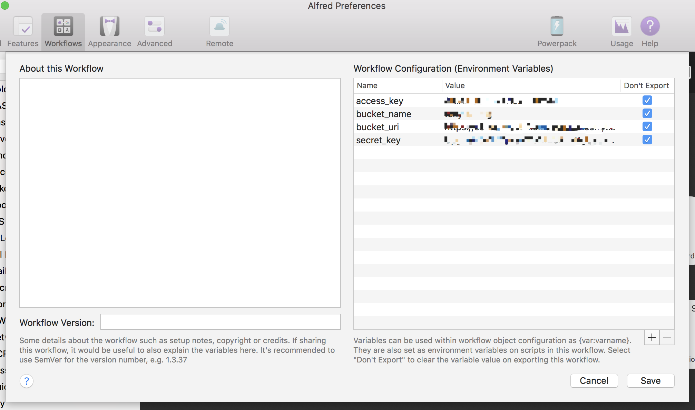

# Create Alfred workflow for uploading screenshot to S3

As Markdown markup language gets more and more popular, most people have a need to quickly generate a public url for screenshot/image in clipboard. Today I created an Alfred workflow that helps you upload images/screenshot in clipboard.

## Demo



## Overview

1. Use `pngpaste` to get image data from clipboard
2. Write to a image file in `/tmp` folder
3. Use `boto3` to upload image file to AWS S3

## Implementation

Now we have the idea to achieve the goal, let's do it in Alfred workflow and python script.

### Create Alfred workflow

Create `Blank Workflow` and give it a name

Right click in background and select `Inputs -> Keyword`



Give it a keyword which you will be typing to trigger the workflow



Right click in background and select `Actions -> Run Script`

Let's make it use Python to run a script



Click on the icon on the left of `Cancel` button to open workflow folder

Create a script file (Make sure the file name is the same as the `Run Script` action uses) and edit like below

```python
#!/usr/bin/python
# -*- coding: utf-8 -*-
from __future__ import print_function
import datetime
import os
import sys
import atexit
import imghdr
from subprocess import call
from os.path import expanduser, exists, basename, getsize
from workflow import Workflow

def capture():
    file_name = datetime.datetime.now().strftime('%Y_%m_%d_%H_%M_%S.png')
    file_path = os.path.join('/tmp', file_name)
    atexit.register(lambda x: os.remove(x) if os.path.exists(x) else None, file_path)
    save = call(['./pngpaste', file_path])
    if save == 1:
        # Quit job if no image found in clipboard
        print "No image found in clipboard"
        sys.exit()
    return file_path, file_name

def main(wf):
    import boto3
    file_path, file_name = capture()
    bucket_name = os.getenv('bucket_name')
    s3 = boto3.client(
        's3',
        aws_access_key_id=os.getenv('access_key'),
        aws_secret_access_key=os.getenv('secret_key')
    )
    s3.upload_file(file_path, bucket_name, file_name, ExtraArgs={'ContentType': "image/png"})
    output = "%s/%s" %(os.getenv('bucket_uri'), file_name)
    print (output,end='')

if __name__ == '__main__':
    wf = Workflow(libraries=['./lib'])
    sys.exit(wf.run(main))
```

This script will return the image public url and let's copy it to clipboard and push a notification.

Right click on the background and select `Outputs –> Copy to Clipboard`



Right click on the background and select `Outputs –> Post Notification`



Now let's connect those boxes like below:



### Include libraries

In the scripts, we used below libraries and need to be included in the workflow to make sure they can be run without issue

- [Workflow](http://alfredworkflow.readthedocs.io/en/latest/installation.html)
- [awscli](https://docs.aws.amazon.com/cli/latest/userguide/installing.html)
- [boto3](https://boto3.readthedocs.io/en/latest/guide/quickstart.html#installation)
- [pngpaste](https://github.com/jcsalterego/pngpaste)

Install above libraries like below:

```sh
pip install --target=/path/to/workflow Alfred-Workflow
pip install --target=/path/to/workflow/lib awscli
pip install --target=/path/to/workflow/lib boto3
brew install pngpaste
```

Please note that pngpaste is a command line tool and you should copy the binary file to `/path/to/workflow`.

### Add environment variables

In the script, we used below variables that we want to make it configurable instead of hard coded:

- access_key: S3 access key

- secret_key: S3 access secret

- bucket_name: S3 bucket name. e.g. `my-bucket-name`

- bucket_uri: S3 bucket URI without trailing slash. e.g. `https://s3-us-west-1.amazonaws.com/my-bucket-name`

Add and config above environment variables into workflow environment variables settings like below



Follow instructions [here](https://docs.aws.amazon.com/IAM/latest/UserGuide/id_credentials_access-keys.html#Using_CreateAccessKey) to create access key and secret if you don't have it already

Make sure the user can read/write to S3 bucket.

## Complete

Congratulations You made it! Give it a try!

## Follow-up

Now you may think of adding support for the workflow to be able to upload any image from local. As you are getting familiar with Alfred workflow development, feel free to give it a try!

Download in Github:

[tonyxu-io/Alfred-Workflow-Upload-S3](https://github.com/tonyxu-io/Alfred-Workflow-Upload-S3)

References:

- [使用 Alfred workflow 上传截图到七牛并自动生成外链URL](http://xfyuan.github.io/2017/03/use-alfred-to-auto-upload-screenshot-to-qiniu-and-generate-the-markdown-image-url/)
- [Alfred Workflow —— 上传剪贴板的图片到七牛](http://labmain.com/2016/04/06/A_Alfred_Workflow_upload_clipboard%27image_to_qiniu/)