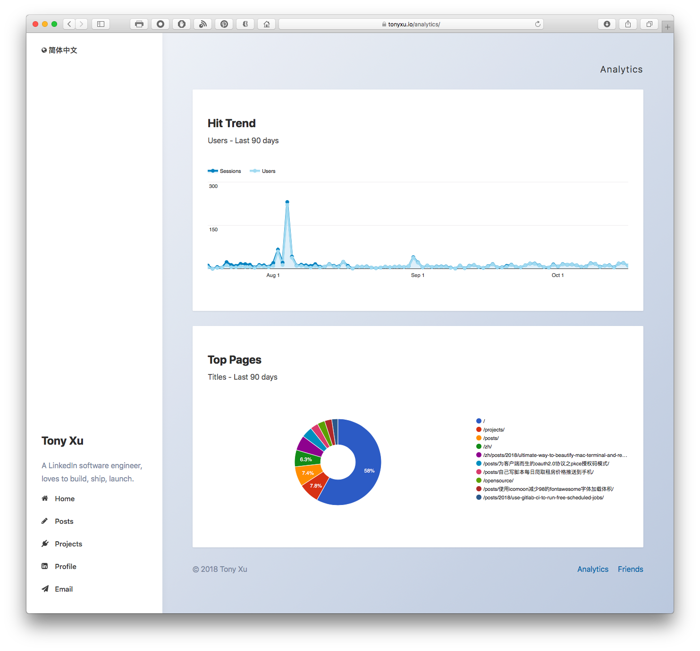
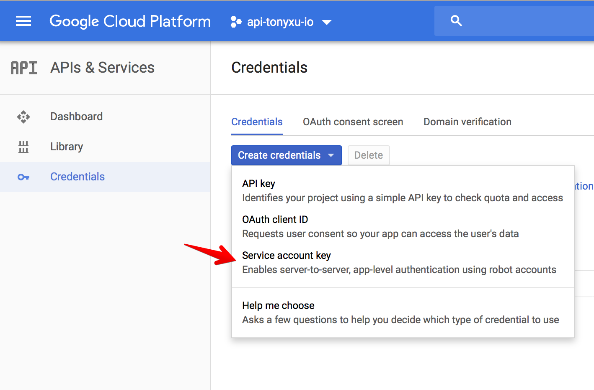
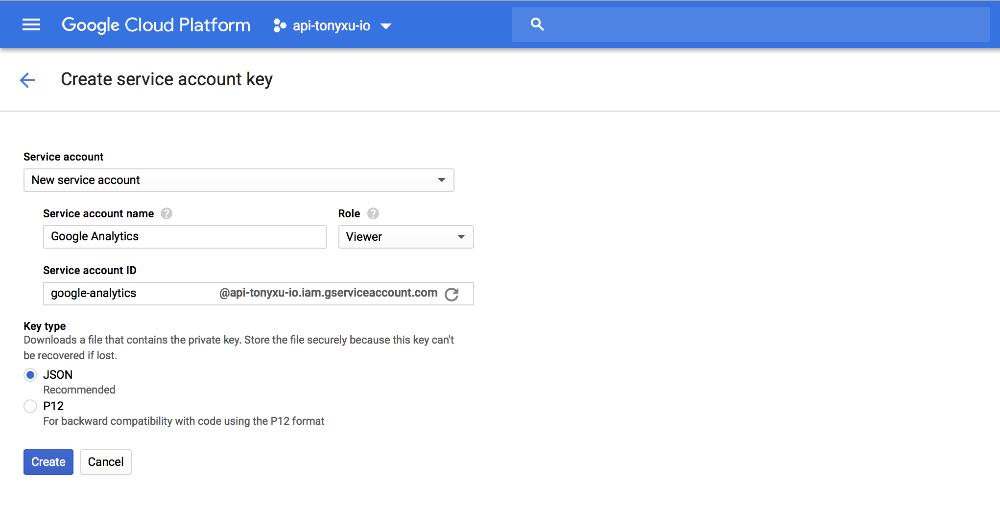
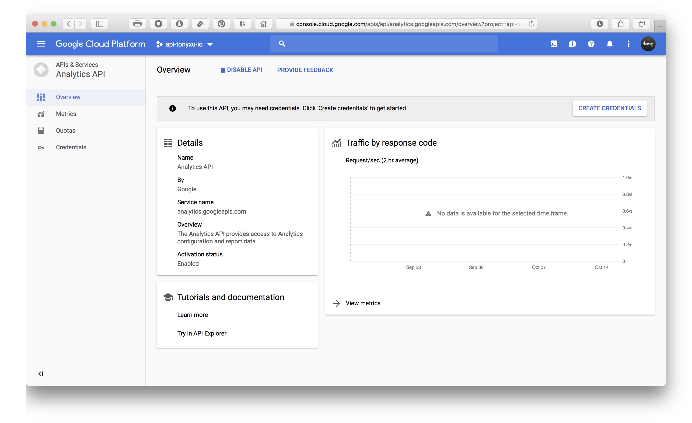
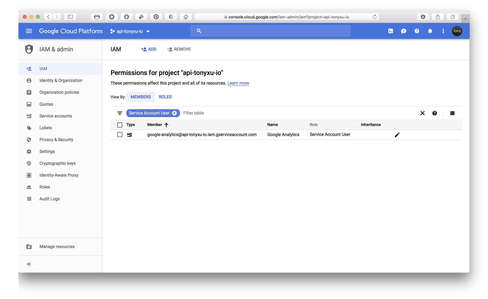
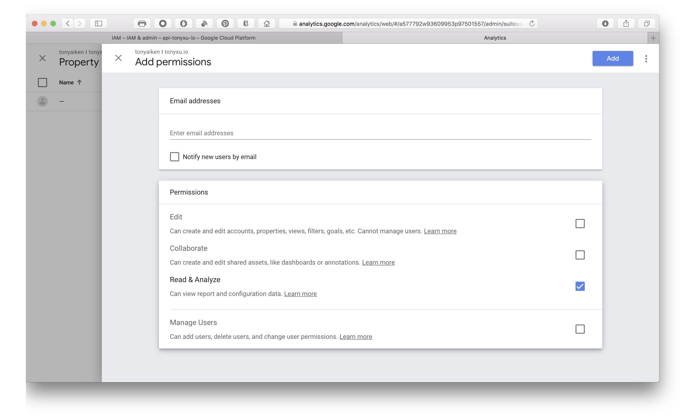

# Embed Google Analytics Dashboard on Website

If you are using Google Analytics to analyze site traffic, you might want to embed those amazing dashboards to your website publicly. While Google doesn't provide iframe solution, it does offer a [Google Analytics Embed API](https://developers.google.com/analytics/devguides/reporting/embed/v1/) which requires a bit more technical knowledge. I'll walk you through each and every step and make sure you don't have to read all developer documentation and can easily build dashboard

Preview:



<!--more-->

### 1. Create project in [Google Developers Console](https://console.developers.google.com/)

_(Ignore this step if you already have Google Developers Project)_

### 2. Create service account and download `.json` key file





### 3. Enable Google Analytics API



### 4. Grant service account to access Analytics account

Obtain service account email address



Add as read only user in Analytics account user management



### 5. Generate access token in server

We are using service account to generate access token in server to avoid user login process.

#### Node.js Server Implementation (Part)

Install Google API Client Library

```bash
npm install --save googleapis
```

Import service account key

```javascript
let privateKey = require("./google_key.json");
```

Return Google access token to client

```javascript
// https://your-domain/accessTokens will return access tokens such as google access tokens
app.get("/accessTokens", (req,res) => {

  let {google} = require('googleapis');
  let privateKey = require("./google_key.json");

  // configure a JWT auth client
  let jwtClient = new google.auth.JWT(
    privateKey.client_email,
    null,
    privateKey.private_key,
    'https://www.googleapis.com/auth/analytics.readonly');
  
    jwtClient.authorize(function (err, token) {
    if (err) {
      console.log(err);
      return res.status(500).send('Error');
    } else {
      return res.send(token.access_token);
    }
  });
})
```

#### Python Server Implementation (Part)

Install Google API Client Library

```bash
sudo pip install --upgrade google-api-python-client
```

Return Google access token to client

```python
# service-account.py

from oauth2client.service_account import ServiceAccountCredentials

# The scope for the OAuth2 request.
SCOPE = 'https://www.googleapis.com/auth/analytics.readonly'

# The location of the key file with the key data.
KEY_FILEPATH = 'path/to/json-key.json'

# Defines a method to get an access token from the ServiceAccount object.
def get_access_token():
  return ServiceAccountCredentials.from_json_keyfile_name(
      KEY_FILEPATH, SCOPE).get_access_token().access_token
```

### 6. Load Google Analytics Embed API library

```html
<script>
(function(w,d,s,g,js,fs){
  g=w.gapi||(w.gapi={});g.analytics={q:[],ready:function(f){this.q.push(f);}};
  js=d.createElement(s);fs=d.getElementsByTagName(s)[0];
  js.src='https://apis.google.com/js/platform.js';
  fs.parentNode.insertBefore(js,fs);js.onload=function(){g.load('analytics');};
}(window,document,'script'));
</script>
```

### 7. Add dashboard containers

```html
<div id="chart-1-container"></div>
<div id="chart-2-container"></div>
```

### 8. Fetch Google access token and load dashboards

```html
<script>

gapi.analytics.ready(function () {

  fetch('/api/accessTokens')
    .then(function (response) {
      gapi.analytics.auth.authorize({
        'serverAuth': {
          'access_token': response
        }
      });
      dataChart1.execute();
      dataChart2.execute();
    });

  var dataChart1 = new gapi.analytics.googleCharts.DataChart({
    query: {
      'ids': 'ga:00000000', // <-- Replace with the ids value for your view.
      'start-date': '90daysAgo',
      'end-date': 'today',
      'metrics': 'ga:sessions,ga:users',
      'dimensions': 'ga:date'
    },
    chart: {
      'container': 'chart-1-container',
      'type': 'LINE',
      'options': {
        'width': '100%'
      }
    }
  });

  var dataChart2 = new gapi.analytics.googleCharts.DataChart({
    query: {
      'ids': 'ga:00000000', // <-- Replace with the ids value for your view.
      'start-date': '90daysAgo',
      'end-date': 'today',
      'metrics': 'ga:pageviews,ga:uniquePageviews,ga:timeOnPage,ga:bounces,ga:entrances,ga:exits',
      'sort': '-ga:pageviews',
      'dimensions': 'ga:pagePath',
      'max-results': 10
    },
    chart: {
      'container': 'chart-2-container',
      'type': 'PIE',
      'options': {
        'width': '100%',
        'pieHole': 0.4,
      }
    }
  });

});
</script>
```

References:

- [Google Analytics Embed API - Server-side Authorization](https://ga-dev-tools.appspot.com/embed-api/server-side-authorization/)
- [Google Analytics Embed API - Built-in Components Reference](https://developers.google.com/analytics/devguides/reporting/embed/v1/component-reference)
